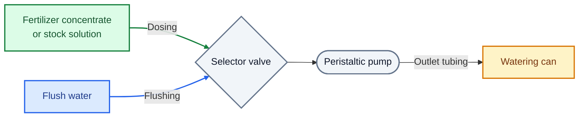

# Automatic Fertilizer Dispenser

The fertilizer dispenser automatically doses fertilizer concentrates or stock solutions using one or more peristaltic pumps. The amount dispensed depends on the selected recipe and the intended irrigation water volume. After dosing, the pump and outlet tubing are flushed with water to help prevent salt deposits.

**Project status:** In development. The Peristaltic pump is currently in the prototyping phase. PCB design is in progress. The user interface and display are still to be determined.

## How It Works

Each recipe specifies a dose in ml per liter of irrigation water for each fertilizer. The required amount is calculated as follows:

```text
Fertilizer volume [ml] = Water volume [L] × Dose [ml/L]

Example: 10 L of water × 5 ml/L = 50 ml of fertilizer
```

A recipe can contain multiple fertilizers. Each fertilizer has its own separate channel, and the fertilizers are mixed only in the watering can. In the future, the device may support mixing fertilizers, after the pumps, to have a single outlet for the mixed solution. 

## Operation

The planned interface consists of a display and a rotary encoder with a push button:

1. **Set the water volume:** Turn the knob. Each detent increases the selected volume by 1 L.
2. **Confirm the volume:** Press the knob to proceed to recipe selection.
3. **Select a recipe:** Turn the knob to choose the desired recipe.
4. **Start dosing:** Press the knob again to dispense the fertilizer.

the further interface planning is still in progress. The display type has not yet been selected.

## Hardware

| Component | Planned configuration |
| --- | --- |
| Controller | ESP32-S3 |
| Channels | Four positions, initially only two populated with TMC2209 modules |
| Motor drivers | Plug-in TMC2209 StepStick modules |
| Driver control | STEP/DIR/EN and UART |
| Pumps | Custom stepper-driven peristaltic pumps, designed in Onshape |
| Motors | NEMA17 stepper motors |
| User interface | Rotary encoder with push button and a display |
| Display | To be selected: a small OLED or another display type; no seven-segment display |
| Calibration | Individual steps-per-ml calibration for each pump |

## Power and USB

### V1

- Motor and solenoid valve operation requires USB-C PD or a separate 12 V power supply.
- USB-C provides data connectivity and firmware flashing.
- USB alone is intended to power the control electronics, including the ESP32-S3 and user interface. Motors and solenoid valves remain inactive without the 12 V supply. The 12 V supply should not be required for firmware flashing.
- USB Power Delivery is included in V1.

## Fluid Path and Flushing

Each fertilizer channel has a selector valve upstream of the pump:



V1 will initially use an inexpensive electrically operated two-position solenoid selector valve.

After dosing, the valve switches to water to flush the pump and outlet tubing. The flushing water also flows into the watering can.

The additional flushing water is not included in the fertilizer dose calculation. For the intended use, this extra volume is considered small relative to the uncertainty of measuring the water volume in a watering can.

### Planned for V2

- "peristaltic" selector valve built out of a servo and a 3D-printed part.
    - The servo connector will already be included on the V1 PCB to simplify this future upgrade.

## Development Status

The operating concept, four channel positions with two initially populated motor drivers, and separate fertilizer paths have been defined.

Practical testing is still pending. The display has not yet been selected.

## Future Possibilities

- Release as an open-source project
- A PCB kit or complete DIY kit
- Accompanying project documentation on YouTube


## License

A license has not yet been selected.
